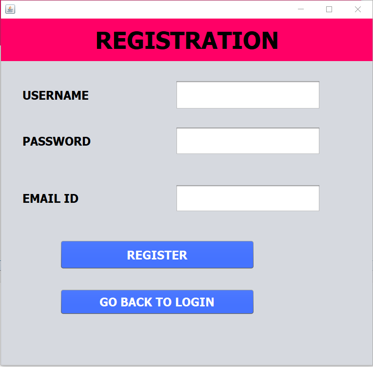
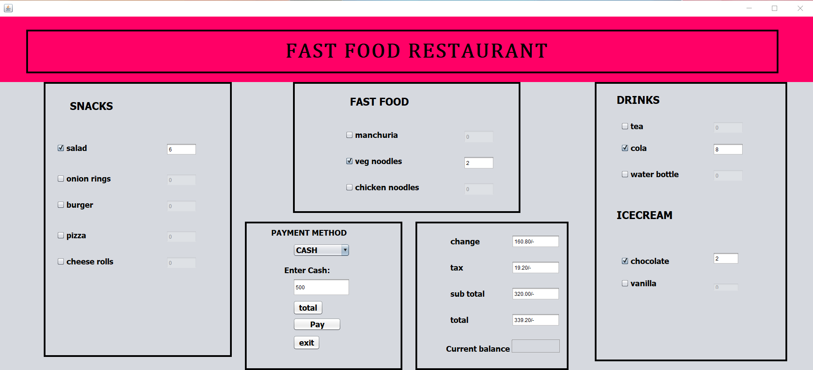
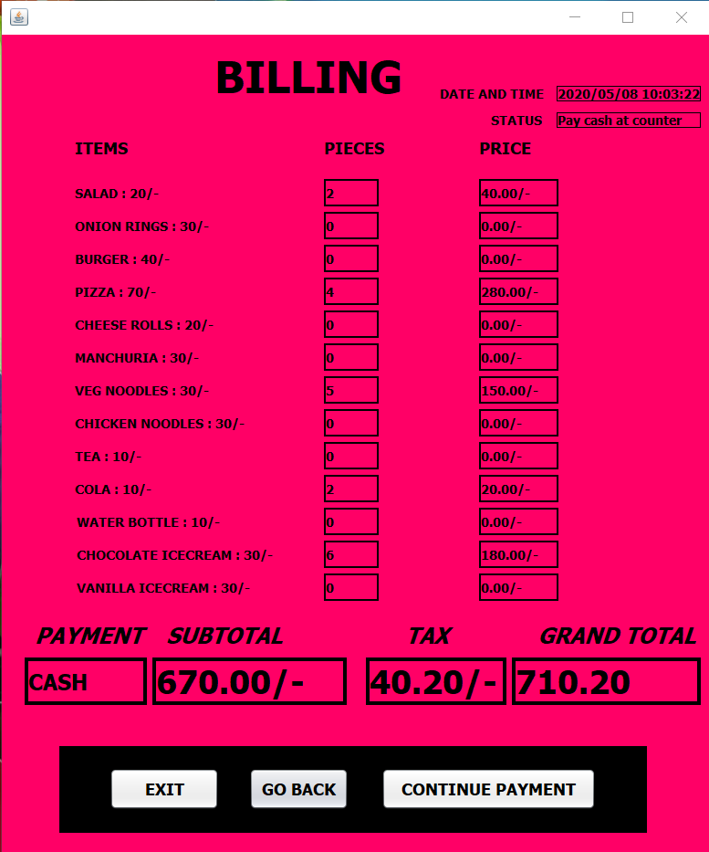

# fast_food_restaurant
A fast food restaurant is a specific type of restaurant where the speed of service is a key consideration for customers. In order to improve ordering services provided to the  customers, the local fast food restaurant can intended to computerize the daily ordering process by developing an automated ordering service system. The main objective of this project is to manage the details of the customers, food, receipts, costs.

